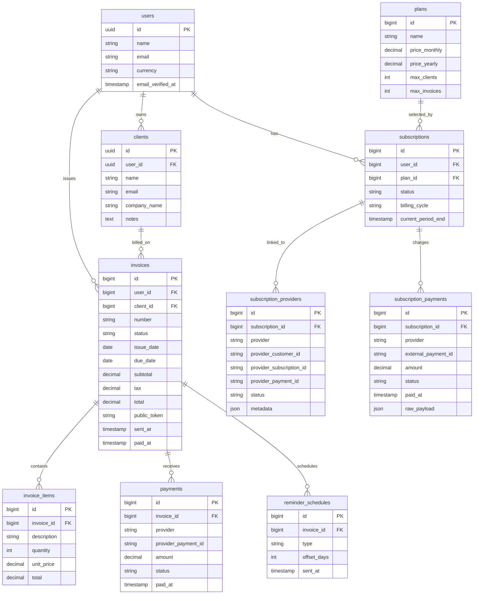

# Database Schema

This document describes the business-domain tables in the project schema, their relationships, and their purpose.

## ER Diagram (Mermaid)

## Table Reference

### users
- Purpose: tenant/account owner for billing data.
- Key fields: `id` (UUID PK), `email` (unique), `currency` (3-char default), 2FA fields.
- Relationships: one-to-many with `clients`, `invoices`, and `subscriptions`.

### clients
- Purpose: invoice recipients managed by each user account.
- Key fields: `id` (UUID PK), `user_id` (FK to `users.id`), contact and optional company metadata.
- Relationships: belongs to `users`; one-to-many with `invoices`.
- Delete behavior: deleting the parent user cascades and deletes clients.

### invoices
- Purpose: billing document lifecycle (`draft`/`sent`/`paid`/`overdue` in domain model).
- Key fields: `id` (PK), `user_id` (FK), `client_id` (FK), `number`, `status`, `issue_date`, `due_date`, `subtotal`, `tax`, `total`, `public_token`, `sent_at`, `paid_at`.
- Relationships: belongs to `users` and `clients`; one-to-many with `invoice_items`, `payments`, `reminder_schedules`.
- Important indexes: `user_id + status`, `user_id + number`, `public_token`, `due_date`.
- Delete behavior: deleting referenced user/client cascades and deletes invoices.

### invoice_items
- Purpose: line items used to compose invoice totals.
- Key fields: `id` (PK), `invoice_id` (FK), `description`, `quantity`, `unit_price`, `total`.
- Relationships: belongs to `invoices`.
- Delete behavior: deleting an invoice cascades and deletes its items.

### payments
- Purpose: payment attempts/records tied to an invoice and provider transaction IDs.
- Key fields: `id` (PK), `invoice_id` (FK), `provider`, `provider_payment_id`, `amount`, `status`, `paid_at`.
- Relationships: belongs to `invoices`.
- Delete behavior: deleting an invoice cascades and deletes payment records.

### reminder_schedules
- Purpose: scheduled reminders relative to invoice due dates.
- Key fields: `id` (PK), `invoice_id` (FK), `type`, `offset_days`, `sent_at`.
- Relationships: belongs to `invoices`.
- Delete behavior: deleting an invoice cascades and deletes reminder schedules.

### plans
- Purpose: product plans and limits used by subscriptions.
- Key fields: `id` (PK), `name`, `price_monthly`, `price_yearly`, `max_clients`, `max_invoices`.
- Relationships: one-to-many with `subscriptions`.

### subscriptions
- Purpose: user subscription state and billing period tracking.
- Key fields: `id` (PK), `user_id` (FK), `plan_id` (FK), `status`, `billing_cycle`, `current_period_end`.
- Relationships: belongs to `users` and `plans`; one-to-many with `subscription_providers` and `subscription_payments`.
- Delete behavior: deleting the referenced user or plan cascades and deletes subscriptions.

### subscription_providers
- Purpose: external subscription linkage data per provider (customer/subscription/payment IDs and metadata).
- Key fields: `id` (PK), `subscription_id` (FK), `provider`, `provider_customer_id`, `provider_subscription_id`, `provider_payment_id`, `status`, `metadata`.
- Relationships: belongs to `subscriptions`.
- Delete behavior: deleting a subscription cascades and deletes provider rows.

### subscription_payments
- Purpose: subscription billing history and webhook/raw gateway payload archive.
- Key fields: `id` (PK), `subscription_id` (FK), `provider`, `external_payment_id`, `amount`, `status`, `paid_at`, `raw_payload`.
- Relationships: belongs to `subscriptions`.
- Delete behavior: deleting a subscription cascades and deletes payment rows.

## Known Inconsistencies / Notes

- `users.id` is UUID, while `invoices.user_id` and `subscriptions.user_id` were created as `foreignId` (integer FK). This is a type mismatch in migration intent and should be corrected in future migrations.
- Migration `2026_03_02_151410_make_provider_subscription_id_nullable_in_subscription_providers.php` is currently empty, so `subscription_providers.provider_subscription_id` remains non-nullable in the applied schema.
- The diagram and table notes document current observed schema state from migrations and `database/database.sqlite`.
